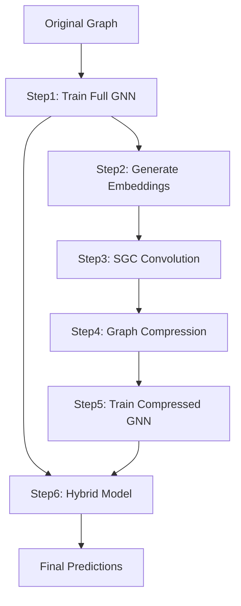

# RelBench GNN Training Pipeline: Step-by-Step Implementation

This directory contains a comprehensive 6-step pipeline for training Graph Neural Networks on heterogeneous temporal graphs using the RelBench framework. The pipeline demonstrates an innovative approach combining large-scale graph training, SGC convolution, graph compression, and hybrid model evaluation.

## 📋 Overview

The pipeline implements a novel graph neural network training approach that:
1. **Trains a full-scale GNN** on the original large heterogeneous graph
2. **Extracts high-quality node embeddings** using pre-trained encoders
3. **Applies parameter-free SGC convolution** for multi-hop information aggregation
4. **Compresses the graph** using KMeans clustering while preserving semantic relationships
5. **Trains a lightweight model** on the compressed graph for efficiency
6. **Creates a hybrid model** combining the strengths of both approaches

## 🚀 Quick Start

### Prerequisites

```bash
# Install required dependencies
pip install torch torch-geometric torch-frame sklearn numpy pandas tqdm
```

### Basic Usage

```bash
# Step 1: Train base GNN model
python step1.py --dataset rel-event --task user-attendance --epochs 10

# Step 2: Generate node embeddings
python step2.py --dataset rel-event --task user-attendance

# Step 3: Apply SGC convolution
python step3.py --dataset rel-event --task user-attendance --num_layers 2

# Step 4: Graph compression (optional, integrated in step5)
python step4.py --dataset rel-event --task user-attendance --compression_rate 0.05

# Step 5: Train compressed model
python step5.py --dataset rel-event --task user-attendance --compression_rate 0.05

# Step 6: Hybrid model evaluation
python step6.py --dataset rel-event --task user-attendance
```

## 📚 Detailed Step Descriptions

### Step 1: Base GNN Training (`step1.py`)
**Purpose**: Train a complete heterogeneous GNN model on the original large graph.

**Key Features**:
- Supports binary classification, regression, and multi-label classification
- Uses NeighborLoader for efficient batch processing
- Implements temporal sampling strategies
- Early stopping with validation-based model selection
- Saves trained encoder and temporal_encoder for reuse

**Key Parameters**:
- `--epochs`: Number of training epochs (default: 10)
- `--batch_size`: Batch size for training (default: 512)
- `--channels`: Hidden dimension size (default: 128)
- `--num_layers`: Number of GNN layers (default: 2)
- `--max_steps_per_epoch`: Maximum steps per epoch for large graphs (default: 2000)

**Output**: Trained model saved to `./saved_models/{dataset}_{task}_step1.pth`

### Step 2: Embedding Generation (`step2.py`)
**Purpose**: Generate high-quality node embeddings using the pre-trained encoder and temporal encoder.

**Key Features**:
- Loads pre-trained model from Step 1
- Extracts features using encoder (structural features)
- Applies temporal_encoder (temporal information)
- Combines both encodings: `final_embedding = feature_embedding + temporal_embedding`
- Preserves node indices for consistency across steps

**Output**: Node embeddings saved to `./saved_embeddings/{dataset}_{task}_embeddings_step2.pth`

### Step 3: SGC Convolution (`step3.py`)
**Purpose**: Apply Simple Graph Convolution (SGC) for parameter-free graph propagation.

**Key Features**:
- **Heterogeneous SGC Implementation**: Custom SGC for heterogeneous graphs
- **Metapath Generation**: Automatically generates length-3 metapaths (e.g., A→B→A)
- **Matrix-based Propagation**: Efficient sparse matrix operations
- **Multi-layer Aggregation**: Supports multiple propagation layers
- **Metapath Fusion**: Averages information from different semantic paths

**Technical Details**:
- Builds base adjacency matrices for each edge type
- Composes metapath adjacency matrices via matrix multiplication
- Applies row normalization to prevent feature explosion
- Performs `H^(l+1) = Ã × H^(l)` propagation

**Output**: Convolved features saved to `./saved_embeddings/{dataset}_{task}_sgc_features_step3.pth`

### Step 4: Graph Compression (`step4.py`)
**Purpose**: Compress large graphs using KMeans clustering while preserving semantic information.

**Key Features**:
- **Node Clustering**: Uses KMeans/MiniBatchKMeans for scalability
- **Label Compression**: Majority voting for cluster label assignment  
- **Edge Reconstruction**: Builds compressed graph edges
- **Adaptive Algorithm Selection**: MiniBatchKMeans for large node types (>50k nodes)

**Key Parameters**:
- `--compression_rate`: Compression ratio (default: 0.05 = 5%)

**Technical Details**:
- Clusters nodes based on SGC-processed features
- Creates cluster centers as compressed node representations
- Maps original edges to cluster-level edges
- Preserves graph connectivity patterns

**Note**: This step is integrated into Step 5, but can be run independently.

### Step 5: Compressed Model Training (`step5.py`)
**Purpose**: Train a lightweight GNN model on the compressed graph.

**Key Features**:
- **CompressedGNN Architecture**: Supports both GCN and MLP modes
- **Flexible Design**: GCN for further graph convolution, MLP for SGC-processed features
- **Fast Training**: Trains on significantly smaller compressed graphs
- **Automatic Integration**: Calls Step 4's compression methods internally

**Model Architecture Options**:
- **Convolution Mode**: Uses GCNConv layers for additional graph processing
- **MLP Mode**: Pure feedforward network (recommended after SGC)

**Key Parameters**:
- `--use_convolution`: Enable GCN layers (default: False)
- `--compression_rate`: Graph compression ratio (default: 0.05)

**Output**: Trained compressed model saved to `./saved_models/compressed_gnn_{dataset}_{task}_best.pth`

### Step 6: Hybrid Model Evaluation (`step6.py`)
**Purpose**: Create and evaluate a hybrid model combining original encoders with compressed GNN.

**Key Features**:
- **Hybrid Architecture**: Original encoder + temporal_encoder → Compressed GNN
- **Inference Optimization**: All components frozen for efficient inference
- **Performance Comparison**: Side-by-side comparison with Step 1 baseline
- **Compatibility**: Seamless integration due to consistent feature spaces

**Architecture Flow**:
```
Input Batch → Encoder → Feature Embeddings
              ↓
Time Info → Temporal Encoder → Temporal Embeddings  
              ↓
Feature + Temporal → Target Features → Compressed GNN → Predictions
```

**Key Insight**: The compressed GNN was trained on encoder+temporal_encoder features, enabling direct usage without additional adaptation.

## 🔧 Architecture Details

### Model Components

1. **HeteroEncoder**: Processes heterogeneous node features
2. **HeteroTemporalEncoder**: Handles temporal information
3. **HeteroGraphSAGE**: Graph convolution layers
4. **HeteroSGCConv**: Parameter-free graph convolution
5. **CompressedGNN**: Lightweight model for compressed graphs
6. **HybridModel**: Combines original encoders with compressed predictor

### Data Flow



## 📊 Performance Characteristics

### Computational Benefits
- **Training Speed**: Step 1 limited to 2000 steps/epoch for scalability
- **Memory Efficiency**: Graph compression reduces memory usage by ~95%
- **Inference Speed**: Hybrid model provides fast inference with maintained accuracy

### Accuracy Preservation
- **Feature Quality**: Pre-trained encoders capture rich representations
- **Semantic Preservation**: SGC maintains multi-hop relationships
- **Information Retention**: Clustering preserves semantic similarity

## 🛠️ Customization Options

### Dataset Support
- Binary classification tasks
- Regression tasks  
- Multi-label classification tasks
- Temporal heterogeneous graphs

### Hyperparameter Tuning
- Compression rates (0.01 - 0.1 recommended)
- SGC propagation layers (1-3 layers)
- Model architectures (GCN vs MLP)
- Training configurations

### Extension Points
- Custom metapath generation strategies
- Alternative clustering algorithms
- Different fusion methods for hybrid models
- Task-specific post-processing

## 📁 File Structure

```
examples/
├── step1.py              # Base GNN training
├── step2.py              # Embedding generation  
├── step3.py              # SGC convolution
├── step4.py              # Graph compression
├── step5.py              # Compressed model training
├── step6.py              # Hybrid model evaluation
├── model.py              # Base model definitions
├── text_embedder.py      # Text embedding utilities
└── saved_models/         # Model checkpoints
    ├── {dataset}_{task}_step1.pth
    └── compressed_gnn_{dataset}_{task}_best.pth
└── saved_embeddings/     # Intermediate embeddings
    ├── {dataset}_{task}_embeddings_step2.pth
    └── {dataset}_{task}_sgc_features_step3.pth
```

## 🔍 Troubleshooting

### Common Issues

1. **Memory Issues**: Reduce batch_size or max_steps_per_epoch
2. **Convergence Problems**: Adjust learning rate or increase epochs
3. **Compression Too Aggressive**: Increase compression_rate
4. **Missing Dependencies**: Install torch-geometric and torch-frame

### Performance Tips

1. **Use GPU**: Significant speedup for large graphs
2. **Adjust Compression Rate**: Balance between speed and accuracy
3. **SGC Layers**: 2-3 layers usually sufficient
4. **Batch Size**: Larger batches for stable training

## 📖 References

This implementation draws inspiration from:
- **SGC**: Simple Graph Convolution (Wu et al.)
- **FreeHGC**: Free Heterogeneous Graph Convolution
- **RelBench**: Relational Deep Learning Benchmark
- **PyTorch Geometric**: Graph neural network library

## 🤝 Contributing

Feel free to submit issues, feature requests, or pull requests to improve this pipeline!

## 📄 License

This code is part of the RelBench project. Please refer to the main repository for licensing information.
